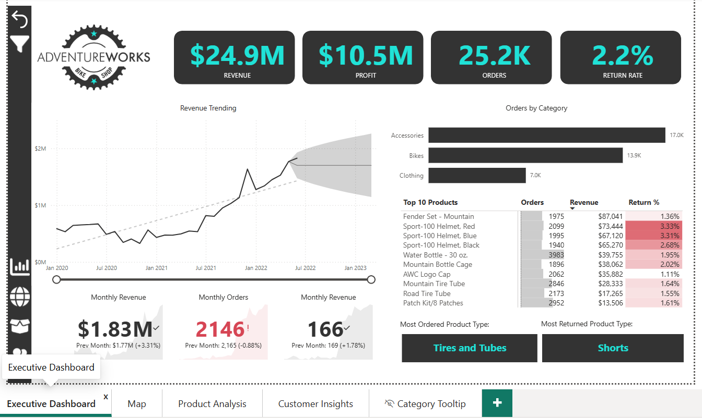
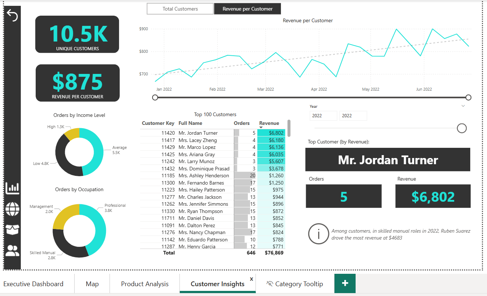
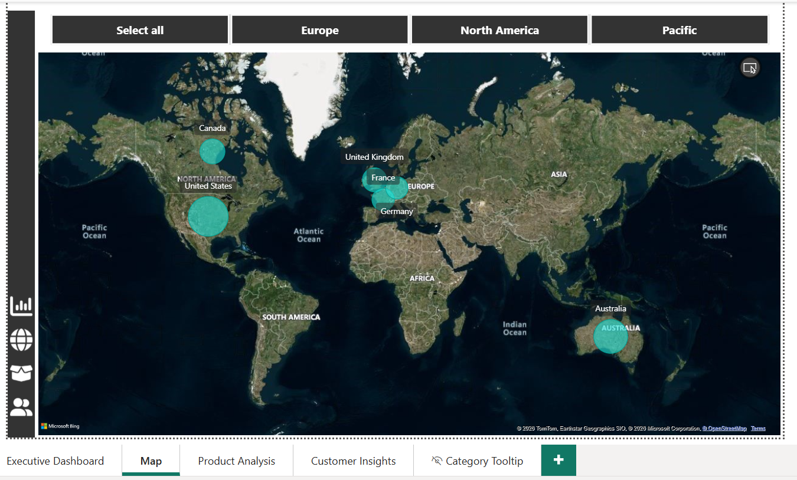
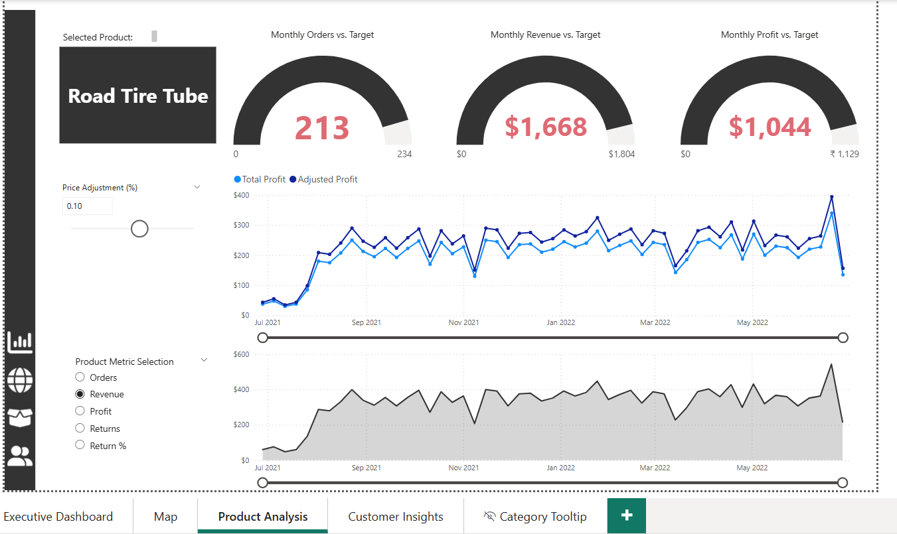
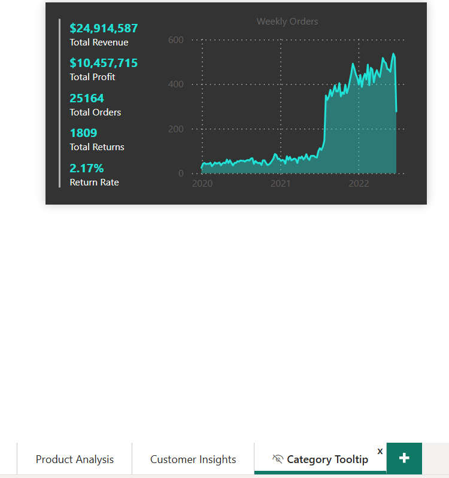

# AdventureWorks Sales Analytics Dashboard (Power BI)

## 📌 Overview

This project presents an interactive sales analytics dashboard built using Power BI to analyze revenue performance, customer behavior, product trends, and business KPIs using the AdventureWorks dataset.

---

## 🎯 Objectives

* Analyze revenue and profit trends
* Track customer purchasing behavior
* Evaluate product performance and return rates
* Monitor business KPIs through interactive dashboards

---

## 🛠️ Tools Used

* Power BI
* DAX
* Data Modeling
* Data Visualization

---

## 📊 Dashboard Pages

* Executive Dashboard
* Customer Insights
* Product Analysis
* Geographic Analysis
* Tooltip Analysis

---

## 🔗 Live Dashboard

👉 [View Power BI Dashboard Here](https://app.powerbi.com/links/LLpAnjS0Gv?ctid=3e4b9d6c-8566-41ad-ac1d-eafe1108951e&pbi_source=linkShare)

---

## 📸 Dashboard Preview

### Executive Dashboard

### Customer Insights

### Geographic Analysis

### Product Analysis

### Tooltip Analysis

---

## 🚀 Key Features

* KPI Monitoring Dashboard
* Revenue & Profit Trend Analysis
* Customer Revenue Insights
* Product Performance Tracking
* Interactive Geographic Mapping
* Dynamic Tooltips & Drilldowns

---

## 📁 Project Files

* `AdventureWorks_Sales_Analytics.pbix`
* Dashboard screenshots
* README documentation

---

## 📬 Contact

* LinkedIn: *(www.linkedin.com/in/muhammedshifin)*

---
